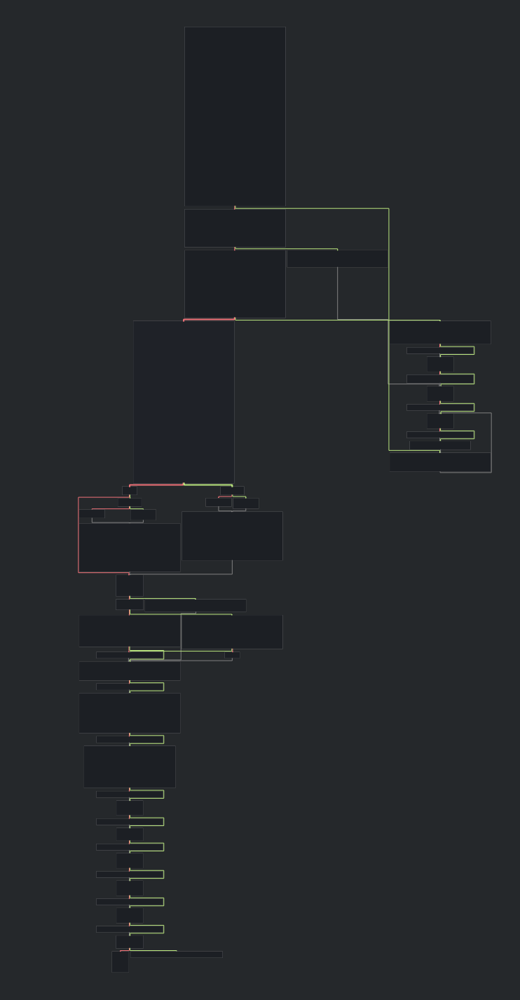
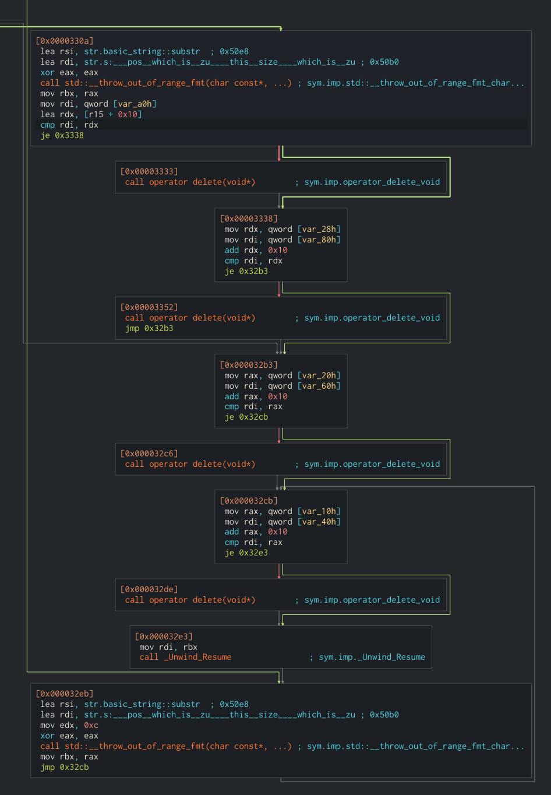
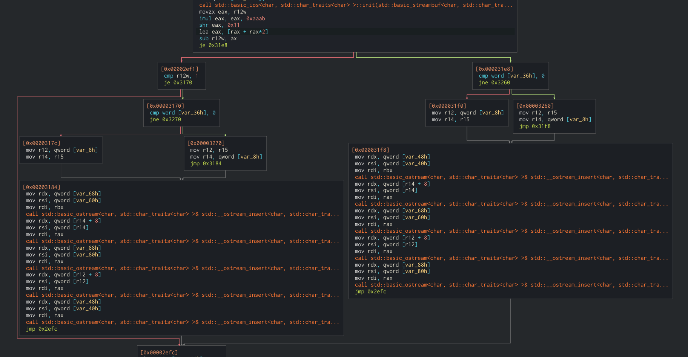

# Reverse engineering process

## Prerequisites

Start by fetching a copy of libvatsimauth. I got mine from [the *Swift*
client's git
repo](https://github.com/swift-project/externals/tree/53e671fc3ba76f2036b9130314507776d161c6e0/linux-g%2B%2B/64/lib).
I got this version specifically:
`3b7bde099723003b81f836fb97c0543c462f9c70d4dc94ebb54c2b8fac667e88
libvatsimauth.so`


I'm using the x86_64 linux shared object, although I suspect that this could
equally well be done with the Windows dll or OS X dylib.

It's also useful to take a squiz at [the associated header
file](https://github.com/swift-project/externals/blob/53e671fc3ba76f2036b9130314507776d161c6e0/common/include/vatsim/vatsimauth.h)
(Note that in order to compile this with a C compiler [some minor
changes](https://github.com/swift-project/externals/pull/1/files) are
necessary).

Make available some useful tools: `nix-shell -p gdb radare2`, `cutter` is a
pretty nice GUI for radare2 if that's your cup of tea.

## Initial exploration

Let's take a quick look at what symbols are visible in this object.

```bash
objdump --syms --demangle libvatsimauth.so
```
[Output](https://gist.github.com/184220abbd66d98052f81042f75f9dfc)

OK,

- A bunch of C++ string handling
- Things seem to happen in the `vatsim_auth` class
- `std::random_device` usage
- A bunch of MD5 functionality
  - `MD5::finalize()::padding`
  - `MD5::transform(unsigned char const*)`
  - `MD5::init()`
  - `MD5::finalize()`
  - `MD5::MD5()`
  - `MD5::MD5(std::__cxx11::basic_string<char, std::char_traits<char>, std::allocator<char> > const&)`
  - `MD5::MD5(std::__cxx11::basic_string<char, std::char_traits<char>, std::allocator<char> > const&)`
  - `MD5::MD5()`
  - `MD5::decode(unsigned int*, unsigned char const*, unsigned int)`
  - `MD5::hexdigest[abi:cxx11]() const`
  - `MD5::encode(unsigned char*, unsigned int const*, unsigned int)`
  - `MD5::update(unsigned char const*, unsigned int)`
  - `MD5::update(char const*, unsigned int)`

By searching for `md5 finalize transform init decode hexdigest encode update`
we pretty quickly find some source for an MD5 class with these member
functions. I couldn't find a canonical source, so I've included it in this repo
([source](./md5.cpp), [header](./md5.h)). Note that it seems to be being used
without any attribution.  This will come in handy later, particulaly when we
want to examine what's being hashed. Quite surprising to see MD5 being used as
part of a cryptographic protocol!

## Looking at each function

### `vatsim_auth_create`

`vatsim_auth *vatsim_auth_create(uint16_t clientId, const char *privateKey);`

The only documentation I could find in the Swift client regarding these parameters is

```
publicClientID: Your public client ID as issued by the VATSIM administrator.
privateKey: Your private key as issued by the VATSIM administrator.
Further information to the client authentication protocol is kept restricted. (lol)
```

`privateKey` is a 32-long hex-digit string. (I wonder if it's just the MD5 hash
of the client name or something...).

Let's have a look in radare2, we're kind of expecting a C shim which probably
packages up the `char*` into a `std::string` allocates and constructs the
`vatsim_auth` object. That's exactly what we get, the call to the constructor
is in `fcn.00002480`.

```
radare2 -A libvatsimauth.so
[0x00002780]> s sym.vatsim_auth_create
[0x00002a80]> pdf # print da function!
            ;-- rip:
┌ 157: sym.vatsim_auth_create (int64_t arg1, char *s);
│           ; var int64_t var_10h @ rsp+0x10
│           ; var int64_t var_28h @ rsp+0x28
│           ; arg int64_t arg1 @ rdi
│           ; arg char *s @ rsi
│           0x00002a80      4154           push r12
│           0x00002a82      55             push rbp
│           0x00002a83      4189fc         mov r12d, edi               ; arg1
│           0x00002a86      53             push rbx
│           0x00002a87      4889f5         mov rbp, rsi                ; arg2
│           0x00002a8a      48c7c2ffffff.  mov rdx, 0xffffffffffffffff
│           0x00002a91      4883ec30       sub rsp, 0x30
│           0x00002a95      64488b042528.  mov rax, qword fs:[0x28]
│           0x00002a9e      4889442428     mov qword [var_28h], rax
│           0x00002aa3      31c0           xor eax, eax
│           0x00002aa5      488d442410     lea rax, [var_10h]
│           0x00002aaa      4885f6         test rsi, rsi               ; arg2
│           0x00002aad      4889e3         mov rbx, rsp
│           0x00002ab0      48890424       mov qword [rsp], rax
│       ┌─< 0x00002ab4      740d           je 0x2ac3
│       │   0x00002ab6      4889f7         mov rdi, rsi                ; const char *s
│       │   0x00002ab9      e8b2faffff     call sym.imp.strlen         ; size_t strlen(const char *s)
│       │   0x00002abe      488d540500     lea rdx, [rbp + rax]
│       │   ; CODE XREF from sym.vatsim_auth_create @ 0x2ab4
│       └─> 0x00002ac3      4889df         mov rdi, rbx                ; int64_t arg1
│           0x00002ac6      4889ee         mov rsi, rbp                ; int64_t arg2
│           0x00002ac9      e812feffff     call method void std::__cxx11::basic_string<char, std::char_traits<char>, std::allocator<char> >::_M_construct<char const*>(char const*, char const*, std::forward_iterator_tag) [clone .isra.26] ; method.void_std::__cxx11::basic_string_char__std::char_traits_char___std::allocator_char___._M_construct_char_const__char_const__char_const__std::forward_iterator_tag___clone_.isra.26_
│           0x00002ace      bf68000000     mov edi, 0x68               ; 'h'
│           0x00002ad3      e848fcffff     call sym operator new(unsigned long) ; sym.imp.operator_new_unsigned_long_
│           0x00002ad8      410fb7f4       movzx esi, r12w
│           0x00002adc      4889da         mov rdx, rbx
│           0x00002adf      4889c7         mov rdi, rax
│           0x00002ae2      4889c5         mov rbp, rax
│           0x00002ae5      e896f9ffff     call fcn.00002480
│           0x00002aea      488b3c24       mov rdi, qword [rsp]
│           0x00002aee      4883c310       add rbx, 0x10
│           0x00002af2      4839df         cmp rdi, rbx
│       ┌─< 0x00002af5      7405           je 0x2afc
│       │   0x00002af7      e8b4f9ffff     call sym operator delete(void*) ; sym.imp.operator_delete_void_
│       │   ; CODE XREF from sym.vatsim_auth_create @ 0x2af5
│       └─> 0x00002afc      488b4c2428     mov rcx, qword [var_28h]
│           0x00002b01      6448330c2528.  xor rcx, qword fs:[0x28]
│           0x00002b0a      4889e8         mov rax, rbp
│       ┌─< 0x00002b0d      7509           jne 0x2b18
│       │   0x00002b0f      4883c430       add rsp, 0x30
│       │   0x00002b13      5b             pop rbx
│       │   0x00002b14      5d             pop rbp
│       │   0x00002b15      415c           pop r12
│       │   0x00002b17      c3             ret
│       │   ; CODE XREF from sym.vatsim_auth_create @ 0x2b0d
└       └─> 0x00002b18      e863fbffff     call sym.imp.__stack_chk_fail ; void __stack_chk_fail(void)
```

```
[0x00002a80]> s fcn.00002480
[0x00002480]> pdf
            ; CALL XREF from sym.vatsim_auth_create @ 0x2ae5
┌ 6: fcn.00002480 ();
│ bp: 0 (vars 0, args 0)
│ sp: 0 (vars 0, args 0)
│ rg: 0 (vars 0, args 0)
└           0x00002480      ff25da3b2000   jmp qword [method.vatsim_auth.vatsim_auth_unsigned_short__std::__cxx11::basic_string_char__std::char_traits_char___std::allocator_char____const_] ; [0x206060:8]=0x2486
```

Of course, it's a little link table for the shared object, print out the jump
destination and seek there. This happens for all the shims, I'll not mention it
again.

```
[0x00002480]> s method.vatsim_auth.vatsim_auth_unsigned_short__std::__cxx11::basic_string_char__std::char_traits_char___std::allocator_char____const_
[0x00206060]> pD 8

            ;-- method.vatsim_auth.vatsim_auth_unsigned_short__std::__cxx11::basic_string_char__std::char_traits_char___std::allocator_char____const_:
            ;-- vatsim_auth::vatsim_auth(unsigned short, std::__cxx11::basic_string<char, std::char_traits<char>, std::allocator<char> > const&):
            ; CODE XREF from fcn.00002480 @ 0x2480
            0x00206060      .qword 0x0000000000002486                  ; RELOC 64 vatsim_auth::vatsim_auth(unsigned short, std::__cxx11::basic_string<char, std::char_traits<char>, std::allocator<char> > const&) @ 0x000029b0
[0x00206060]> s 0x000029b0
[0x000029b0]> pdf
┌ 79: sym.vatsim_auth::vatsim_auth_unsigned_short__std::__cxx11::basic_string_char__std::char_traits_char___std::allocator_char____const_ (int64_t arg1, int64_t arg3);
│           ; arg int64_t arg1 @ rdi
│           ; arg int64_t arg3 @ rdx
│           0x000029b0      53             push rbx                    ; vatsim_auth::vatsim_auth(unsigned short, std::__cxx11::basic_string<char, std::char_traits<char>, std::allocator<char> > const&)
│           0x000029b1      4889fb         mov rbx, rdi                ; arg1
│           0x000029b4      668937         mov word [rdi], si          ; arg1
│           0x000029b7      488d4318       lea rax, [rbx + 0x18]
│           0x000029bb      488d7f08       lea rdi, [rdi + 8]          ; int64_t arg1
│           0x000029bf      48894308       mov qword [rbx + 8], rax
│           0x000029c3      488b32         mov rsi, qword [rdx]        ; uint32_t arg2
│           0x000029c6      4889f0         mov rax, rsi
│           0x000029c9      48034208       add rax, qword [rdx + 8]    ; arg3
│           0x000029cd      4889c2         mov rdx, rax                ; uint32_t arg3
│           0x000029d0      e80bffffff     call method void std::__cxx11::basic_string<char, std::char_traits<char>, std::allocator<char> >::_M_construct<char const*>(char const*, char const*, std::forward_iterator_tag) [clone .isra.26] ; method.void_std::__cxx11::basic_string_char__std::char_traits_char___std::allocator_char___._M_construct_char_const__char_const__char_const__std::forward_iterator_tag___clone_.isra.26_
│           0x000029d5      488d4338       lea rax, [rbx + 0x38]
│           0x000029d9      48c743300000.  mov qword [rbx + 0x30], 0
│           0x000029e1      c6433800       mov byte [rbx + 0x38], 0
│           0x000029e5      48c743500000.  mov qword [rbx + 0x50], 0
│           0x000029ed      c6435800       mov byte [rbx + 0x58], 0
│           0x000029f1      48894328       mov qword [rbx + 0x28], rax
│           0x000029f5      488d4358       lea rax, [rbx + 0x58]
│           0x000029f9      48894348       mov qword [rbx + 0x48], rax
│           0x000029fd      5b             pop rbx
└           0x000029fe      c3             ret
```

OK, so it:

- puts the client id at offset 0
- copies the private key to a string at offset 8, we see later that this is
  used as part of the hashed value when generating a response
- zero initializes a bunch of other state (as far as I can tell this isn't
  used)

The important thing is that we've established that this isn't really doing
anything meaningful.

### vatsim_auth_destroy

Not gonna bother looking, probably just undoes `vatsum_auth_create`.
Fortunately there doesn't seem to be any global state in play.

### vatsim_auth_get_client_id

```
... After a bit of jumping around
[0x00206150]> s 0x2a00
[0x00002a00]> pdf
┌ 4: sym.vatsim_auth::getClientId___const (int64_t arg1);
│ bp: 0 (vars 0, args 0)
│ sp: 0 (vars 0, args 0)
│ rg: 1 (vars 0, args 1)
│           0x00002a00      0fb707         movzx eax, word [rdi]       ; arg1 ; vatsim_auth::getClientId() const
└           0x00002a03      c3             ret
```

Ok, nice that this confirms what we got from the constructor. Nothing
unexpected here, just returns the client id as saved in the constructor.

### vatsim_auth_set_initial_challenge

`void vatsim_auth_set_initial_challenge(vatsim_auth *obj, const char *initialChallenge)`

```
... After a bit of jumping around
[0x00003410]> pdf
┌ 126: sym.vatsim_auth::setInitialChallenge_std::__cxx11::basic_string_char__std::char_traits_char___std::allocator_char____const_ (int64_t arg1, int64_t arg2);
│           ; var int64_t var_28h @ rsp+0x28
│           ; arg int64_t arg1 @ rdi
│           ; arg int64_t arg2 @ rsi
│           0x00003410      4154           push r12                    ; vatsim_auth::setInitialChallenge(std::__cxx11::basic_string<char, std::char_traits<char>, std::allocator<char> > const&)
│           0x00003412      55             push rbp
│           0x00003413      4c8d4708       lea r8, [rdi + 8]           ; arg1
│           0x00003417      53             push rbx
│           0x00003418      4889fb         mov rbx, rdi                ; arg1
│           0x0000341b      4889f2         mov rdx, rsi                ; arg2
│           0x0000341e      4c8d6328       lea r12, [rbx + 0x28]
│           0x00003422      4889fe         mov rsi, rdi                ; arg1
│           0x00003425      4883ec30       sub rsp, 0x30
│           0x00003429      0fb70f         movzx ecx, word [rdi]       ; arg1
│           0x0000342c      4889e7         mov rdi, rsp
│           0x0000342f      4889e5         mov rbp, rsp
│           0x00003432      64488b042528.  mov rax, qword fs:[0x28]
│           0x0000343b      4889442428     mov qword [var_28h], rax
│           0x00003440      31c0           xor eax, eax
│           0x00003442      4883c510       add rbp, 0x10
│           0x00003446      e8d5efffff     call fcn.00002420
│           0x0000344b      4c89e7         mov rdi, r12
│           0x0000344e      4889e6         mov rsi, rsp
│           0x00003451      e89af1ffff     call sym std::__cxx11::basic_string<char, std::char_traits<char>, std::allocator<char> >::swap(std::__cxx11::basic_string<char, std::char_traits<char>, std::allocator<char> >&) ; sym.imp.std::__cxx11::basic_string_char__std::char_traits_char___std::allocator_char___::swap_std::__cxx11::basic_string_char__std::char_traits_char___std::allocator_char____
│           0x00003456      488b3c24       mov rdi, qword [rsp]
│           0x0000345a      4839ef         cmp rdi, rbp
│       ┌─< 0x0000345d      7405           je 0x3464
│       │   0x0000345f      e84cf0ffff     call sym operator delete(void*) ; sym.imp.operator_delete_void_
│       │   ; CODE XREF from vatsim_auth::setInitialChallenge(std::__cxx11::basic_string<char, std::char_traits<char>, std::allocator<char> > const&) @ 0x345d
│       └─> 0x00003464      488d7b48       lea rdi, [rbx + 0x48]
│           0x00003468      4c89e6         mov rsi, r12
│           0x0000346b      e820f1ffff     call sym std::__cxx11::basic_string<char, std::char_traits<char>, std::allocator<char> >::_M_assign(std::__cxx11::basic_string<char, std::char_traits<char>, std::allocator<char> > const&) ; sym.imp.std::__cxx11::basic_string_char__std::char_traits_char___std::allocator_char___::_M_assign_std::__cxx11::basic_string_char__std::char_traits_char___std::allocator_char____const_
│           0x00003470      488b442428     mov rax, qword [var_28h]
│           0x00003475      644833042528.  xor rax, qword fs:[0x28]
│       ┌─< 0x0000347e      7509           jne 0x3489
│       │   0x00003480      4883c430       add rsp, 0x30
│       │   0x00003484      5b             pop rbx
│       │   0x00003485      5d             pop rbp
│       │   0x00003486      415c           pop r12
│       │   0x00003488      c3             ret
│       │   ; CODE XREF from vatsim_auth::setInitialChallenge(std::__cxx11::basic_string<char, std::char_traits<char>, std::allocator<char> > const&) @ 0x347e
└       └─> 0x00003489      e8f2f1ffff     call sym.imp.__stack_chk_fail ; void __stack_chk_fail(void)
```

This looks to me like a bunch of function-setup/argument-shuffling, a call to
`fcn.00002420`, un-setup. Let's look at `fcn.00002420`.

```
[0x00003410]> s fcn.00002420
[0x00002420]> pdf
            ; CALL XREF from vatsim_auth::setInitialChallenge(std::__cxx11::basic_string<char, std::char_traits<char>, std::allocator<char> > const&) @ 0x3446 ; sym.vatsim_auth::setInitialChallenge_std::__cxx11::basic_string_char__std::char_traits_char___std::allocator_char____const_
            ; CALL XREF from vatsim_auth::generateAuthResponse(std::__cxx11::basic_string<char, std::char_traits<char>, std::allocator<char> > const&) @ 0x356f ; sym.vatsim_auth::generateAuthResponse_std::__cxx11::basic_string_char__std::char_traits_char___std::allocator_char____const_
┌ 6: fcn.00002420 ();
│ bp: 0 (vars 0, args 0)
│ sp: 0 (vars 0, args 0)
│ rg: 0 (vars 0, args 0)
└           0x00002420      ff250a3c2000   jmp qword [method.vatsim_auth.generateAuthResponse_std::__cxx11::basic_string_char__std::char_traits_char___std::allocator_char____const__unsigned_short__std::__cxx11::basic_string_char__std::char_traits_char___std::allocator_char____const_] ; [0x206030:8]=0x2426 ; "&$"
```

Interesting, this seems to be calling `generateAuthResponse` with the given
"initial challenge". We'll investigate exactly what that does next, but
basically it's gonna be updating the internal state to keep it in sync with the
challenger.

### vatsim_auth_generate_response

`void vatsim_auth_generate_response(vatsim_auth *obj, const char *challenge, char *response);`

I really like the graph view in `cutter`, it makes it easy to see which
branches are the "failure mode" of the function and prune them from ones
attention.

Here's the whole graph of `vatsim_auth::generateAuthResponse`



For example, we can disregard this whole branch on the right, it's just
destroying things and throwing exceptions (which BY THE WAY are thrown through
the "C" wrapper)



What we see here is pretty encouraging! There's no loops or anything cryptographic looking.
 Just a bunch of string manipulation, a call to `fcn.00002490`,
updating some state (the field we originally put the private key in), and then
destructors and return.

`fcn.00002490` turns out to be `generateMD5Digest`, let's take a quick look.

```
[0x00002a10]> pdf
┌ 107: sym.vatsim_auth::generateMD5Digest_std::__cxx11::basic_string_char__std::char_traits_char___std::allocator_char____const_ (int64_t arg1, int64_t arg3);
│           ; var int64_t var_78h @ rsp+0x78
│           ; arg int64_t arg1 @ rdi
│           ; arg int64_t arg3 @ rdx
│           0x00002a10      4154           push r12                    ; vatsim_auth::generateMD5Digest(std::__cxx11::basic_string<char, std::char_traits<char>, std::allocator<char> > const&)
│           0x00002a12      55             push rbp
│           0x00002a13      4989d4         mov r12, rdx                ; arg3
│           0x00002a16      53             push rbx
│           0x00002a17      4889fd         mov rbp, rdi                ; arg1
│           0x00002a1a      4883c480       add rsp, 0xffffffffffffff80
│           0x00002a1e      4889e7         mov rdi, rsp
│           0x00002a21      64488b042528.  mov rax, qword fs:[0x28]
│           0x00002a2a      4889442478     mov qword [var_78h], rax
│           0x00002a2f      31c0           xor eax, eax
│           0x00002a31      e8cafaffff     call fcn.00002500
│           0x00002a36      418b542408     mov edx, dword [r12 + 8]
│           0x00002a3b      498b3424       mov rsi, qword [r12]
│           0x00002a3f      4889e7         mov rdi, rsp
│           0x00002a42      e829fcffff     call fcn.00002670
│           0x00002a47      4889e7         mov rdi, rsp
│           0x00002a4a      e8a1faffff     call fcn.000024f0
│           0x00002a4f      4889e6         mov rsi, rsp
│           0x00002a52      4889ef         mov rdi, rbp
│           0x00002a55      e846fbffff     call fcn.000025a0
│           0x00002a5a      488b4c2478     mov rcx, qword [var_78h]
│           0x00002a5f      6448330c2528.  xor rcx, qword fs:[0x28]
│       ┌─< 0x00002a68      750c           jne 0x2a76
│       │   0x00002a6a      4883ec80       sub rsp, 0xffffffffffffff80
│       │   0x00002a6e      4889e8         mov rax, rbp
│       │   0x00002a71      5b             pop rbx
│       │   0x00002a72      5d             pop rbp
│       │   0x00002a73      415c           pop r12
│       │   0x00002a75      c3             ret
│       │   ; CODE XREF from vatsim_auth::generateMD5Digest(std::__cxx11::basic_string<char, std::char_traits<char>, std::allocator<char> > const&) @ 0x2a68
└       └─> 0x00002a76      e805fcffff     call sym.imp.__stack_chk_fail ; void __stack_chk_fail(void)
```

This looks easy, it does basically nothing except call:

- `fcn.00002500` (`MD5::MD5()`)
- `fcn.00002670` (`MD5::update`)
- `fcn.000024f0` (`MD5::finalize`)
- `fcn.000025a0` (`MD5::hexdigest`)

We have the source for these, so it should be pretty simple to find a good
point to insert a breakpoint and snoop what's going in and out, and hopefully
save us the trouble of untangling the string manipulation in
`generateAuthResponse`. In retrospect the response generation is so simple that
we probably could have led with this snooping and not bothered with the rest of it; on
the other hand *radare2* is a fun tool to use and time one enjoys wasting isn't
really wasted.

We can snoop the input in `update`, it's the second argument (after `this`), so
in `rsi`, with the length in `rdx`.

If we write a small test program, we can do this in *gdb*:

The test program calls `vatsim_auth_create(1,
"abcdefghijklmnopqrstuvwxyz123456")` and
`vatsim_auth_set_initial_challenge(auth, "ABCDEFGHIJKLMNOPQRST")`.

```
(gdb) b MD5::update(char const*, unsigned int)
Function "MD5::update(char const*, unsigned int)" not defined.
Make breakpoint pending on future shared library load? (y or [n]) y
Breakpoint 1 (MD5::update(char const*, unsigned int)) pending.
(gdb) run
Starting program: /home/e/projects/openvatauthlib/test
[Thread debugging using libthread_db enabled]
Using host libthread_db library "/nix/store/z56jcx3j1gfyk4sv7g8iaan0ssbdkhz1-glibc-2.33-56/lib/libthread_db.so.1".
creating

Breakpoint 1, 0x00007ffff7dc1b40 in MD5::update(char const*, unsigned int) () from ./libvatsimauth.so
(gdb) x/1sb $rsi
0x5555555bbaa0: "abcdefghijklKLMNOPQRSTmnopqrstuvABCDEFGHIJwxyz123456"
```

```
abcdefghijkl KLMNOPQRST mnopqrstuv ABCDEFGHIJ wxyz123456
kkkkkkkkkkkk cccccccccc kkkkkkkkkk cccccccccc kkkkkkkkkk
```

From this output, it's pretty clear to see that `generateAuthResponse` is returning:

`MD5(state[0..11] + last half of challenge + state[12..21] + first half of challenge + state[22..31])`

If we run `vatsim_auth_generate_response` instead of
`vatsim_auth_set_initial_challenge` we can see that `MD5::update` is being
called again, with a 64B input, no doubt to update the internal state ready for
the next response. With the above setup and
`vatsim_auth_generate_response(auth, "qwertyuiop")` we get:

- A response of `md5(c8e846adf9bd + yuiop + 9a72a9d72e + qwert + b3e4a5e7b7)` = ` `
- A state update of `md5(old state + response)`

Now that we know more or less what we're looking for let's reexamine
`vatsim_auth::generateAuthResponse`. We can see in the block at 0x3184 there
are 5 calls to `std::__ostream_insert` which matches our concatenation of 5
segments. What's interesting is that there's another block with a similar
structure, and each of these is preceded by a potential swap of the 2nd and 4th
string. This is easiest to see in the graph view:



The branching is predicated on the values of `[var_36h]` and `r12w`, here is how they're set.

```
│           0x00002d66      4489e0         mov eax, r12d
│           0x00002d69      83e001         and eax, 1
│           0x00002d6c      6689442436     mov word [var_36h], ax
```

`[var_36h]` is just set to the lowest bit of `r12`.


```
│     │││   0x00002ed7      410fb7c4       movzx eax, r12w
│     │││   0x00002edb      69c0abaa0000   imul eax, eax, 0xaaab
│     │││   0x00002ee1      c1e811         shr eax, 0x11
│     │││   0x00002ee4      8d0440         lea eax, [rax + rax*2]
│     │││   0x00002ee7      664129c4       sub r12w, ax
│    ┌────< 0x00002eeb      0f84f7020000   je 0x31e8
│    ││││   0x00002ef1      664183fc01     cmp r12w, 1                 ; "ELF\x02\x01\x01"
│   ┌─────< 0x00002ef6      0f8474020000   je 0x3170
```

This is basically branching on `r12w % 3`, involving a division by 3 by
multiplication and shifts.

Following `r12`'s provenance leads it the word pointed to by the first argument
to `vatsim_auth_generate_response`. Which, as discovered in `vatsim_auth_create`,
is the client id being stored at offset 0 in the `vatsim_auth` struct.

#### Response algorithm

Pseudocode for the response is as follows:

```C
split state into s1 s2 s3

if clientId & 1
  split challenge into c1, c2
else
  split challenge into c2, c1

response = case clientId % 3 of
  0 -> md5(concat s1 c1 s2 c2 s3)
  1 -> md5(concat s2 c1 s3 c2 s1)
  _ -> md5("") // lol

state = md5(init + response)
```

I'm perplexed as to why there is a code path leading to no useful hashing. If
one wanted to integrate the client id into the hash result, why not just append
it to the hashed string instead of having it predicate this interleaving...

### vatsim_auth_generate_challenge

`void vatsim_auth_generate_challenge(const vatsim_auth *obj, char *challenge);`

Looking at what happens to `vatsim_auth`, the first parameter, `rdi`, we can
see that it's promptly ignored. Indeed, calling this will `NULL` has no ill
effects.

It returns a 32bit hex string.

Since it doesn't seem to be maintaining any (per `vatsim_auth` object) state,
or be depending on the client id or private key, I'm going to assume it's just
returning `rand()` or something.

Indeed, here's the relevant part, we can see it initializes a
`std::random_device` and does a few MT19937 iterations.

```
│           0x00003789      e882edffff     call sym std::random_device::_M_init(std::__cxx11::basic_string<char, std::char_traits<char>, std::allocator<char> > const&) ; sym.imp.std::random_device::_M_init_std::__cxx11::basic_string_char__std::char_traits_char___std::allocator_char____const_
│           0x0000378e      4889df         mov rdi, rbx
│           0x00003791      e86aeeffff     call sym std::random_device::_M_getval() ; sym.imp.std::random_device::_M_getval__
│           0x00003796      89c0           mov eax, eax
│           0x00003798      b901000000     mov ecx, 1
│           0x0000379d      4c8dac248000.  lea r13, [arg_80h]
│           0x000037a5      488984248000.  mov qword [arg_80h], rax
│       ┌─< 0x000037ad      eb06           jmp 0x37b5
..
│       │   ; CODE XREF from vatsim_auth::generateAuthChallenge[abi:cxx11]() const @ 0x37d8
│      ┌──> 0x000037b0      498b44cdf8     mov rax, qword [r13 + rcx*8 - 8]
│      ╎│   ; CODE XREF from vatsim_auth::generateAuthChallenge[abi:cxx11]() const @ 0x37ad
│      ╎└─> 0x000037b5      4889c2         mov rdx, rax
│      ╎    0x000037b8      48c1ea1e       shr rdx, 0x1e
│      ╎    0x000037bc      4831d0         xor rax, rdx
│      ╎    0x000037bf      4869c0658907.  imul rax, rax, 0x6c078965
│      ╎    0x000037c6      01c8           add eax, ecx
│      ╎    0x000037c8      498944cd00     mov qword [r13 + rcx*8], rax
│      ╎    0x000037cd      4883c101       add rcx, 1
│      ╎    0x000037d1      4881f9700200.  cmp rcx, 0x270              ; "B"
│      └──< 0x000037d8      75d6           jne 0x37b0
│           0x000037da      4889df         mov rdi, rbx
│           0x000037dd      48c784240014.  mov qword [arg_1400h], 0x270 ; [0x270:8]=66 ; "B"
│           0x000037e9      e812efffff     call sym std::random_device::_M_fini() ; sym.imp.std::random_device::_M_fini__
```

### vatsim_get_system_unique_id

Returns the MAC address of a network interface, empty string if there are no
interfaces.

We can see it calling into a function called `getMacHash` (a weird name, given
that the returned string is the MAC address, and not a hash of that (unless my
testing MAC address is a fixed point in whatever hashing scheme they're
using)).

I wonder if it's from here
https://stackoverflow.com/questions/16858782/how-to-obtain-almost-unique-system-identifier-in-a-cross-platform-way/

--------------------

Anyway, that's it! There's a working reimplementation of all of the above in
[openvatsimauth.cpp](./openvatsimauth.cpp)!
